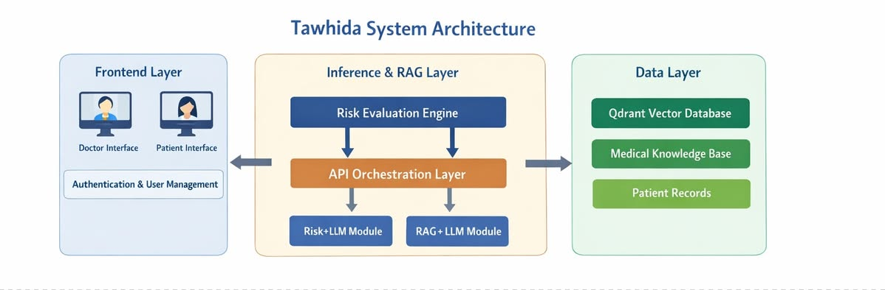

# 🩺 Tawhida  
## Multimodal Breast Cancer Risk Assessment System

---

## 1. Project Overview

**Tawhida** is a **multimodal, retrieval-based clinical decision support system (CDSS)** designed to assess **breast cancer risk** by integrating **genetic, proteomic, clinical text, and pathology image data**.

The system focuses on **non-invasive, pre-imaging risk stratification**, aiming to **reduce unnecessary exposure to ionizing radiation (mammography)**—especially for **young women** and **high-risk populations**.

Tawhida does **not perform autonomous diagnosis or prediction**. Instead, it provides **evidence-grounded similarity-based insights** to support clinicians and inform patients.

---

## 2. Key Objectives

### 🎯 Risk Stratification
- **Screening**: Early identification of asymptomatic women at risk  
- **Follow-up (Suivi)**: Monitoring recurrence risk in breast cancer survivors  

### 🧬 Multimodal Integration
- Genetic mutations (e.g. **BRCA1 / BRCA2**)  
- Protein biomarkers (**ER, PR, HER2**)  
- Pathology reports and histopathology images  

### 🔍 Explainability
- **Doctor Mode**: Similarity scores, modality contributions, biomedical rationale  
- **Patient Mode**: Qualitative risk tiers (*Low / Moderate / High*)  

### ☢️ Radiation Reduction
- Reduce over-screening  
- Limit cumulative radiation exposure  

---

## 3. Technologies Used

| Component | Technology |
|--------|-----------|
| Vector Database | **Qdrant (Cloud)** |
| Retrieval | **RAG (Retrieval-Augmented Generation)** |
| LLM Orchestration | Risk LLM + RAG LLM |
| Indexing | **HNSW** |
| Similarity Metric | **Cosine Similarity** |
| Image Embeddings | **CLIP (ViT-B/32)** |
| Text Embeddings | **BioBERT**, **all-MiniLM-L6-v2** |
| Dataset | **TCGA-BRCA** |

---

## 4. System Architecture

Tawhida is structured into **three layers**:


### 🖥️ Frontend Layer
- Secure web interface  
- Role-based access:
  - Doctor dashboard
  - Patient interface  

### 🧠 Inference & RAG Layer
- Risk Evaluation Engine  
- API orchestration  
- Specialized LLMs:
  - Risk LLM
  - RAG LLM  

### 🗄️ Data Layer
- Qdrant Vector Database  
- Medical Knowledge Base  
- Patient Records  

---

## 5. Qdrant Integration (Biological Memory)

Qdrant acts as the **core similarity engine**, storing multimodal embeddings of historical breast cancer cases.

### 5.1 Modality-Specific Collections

| Collection | Description |
|----------|-------------|
| `genes_collection` | Gene-level mutation embeddings |
| `proteins_collection` | ER / PR / HER2 profiles |
| `pathology_reports_collection` | Clinical report |

Each vector contains:
- Case ID  
- Modality metadata  
- Dataset traceability  

---

### 5.2 Retrieval Workflow

1. Patient data decomposition (genetic, proteomic, text, image)  
2. Modality-specific embedding  
3. Top-K similarity search (cosine similarity)  
4. RAG-based explanation adapted to user role

---

## 6. Repository Structure

```bash
breast-cancer-repository/
│
├── gene_mutation/
├── protein_mutation/
├── pathology_report/
└── Interface/


